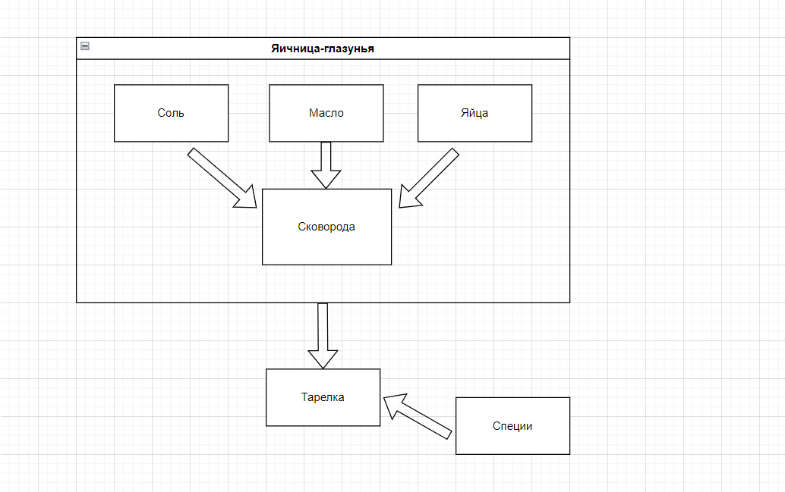

# Тестовое задание

## Стиль

Для приготовления яичницы-глазуньи на 1 порцию вам потребуется:

- 2 яйца
- щепотка соли
- 1 ст.л. растительного масла
- специи по вкусу

1. Холодную сковороду присыпьте солью, затем налейте немного масла и включите огонь.

    > Количество соли легче контролировать до того, как добавили яйца, а холодная сковорода позволит не пережарить блюдо.

1. Разбейте яйца в миску, затем отделите белки от желтков. Вылейте белки на скороводу, спустя 30 секунд добавьте к белкам желтки.
1. Если хотите пропечённые желтки, накройте яичницу крышкой и оставьте на 2 минуты на медленном огне.
4. Положите глазунью на тарелку и посыпьте ее любимыми специями.

Приятного аппетита!

## Системность мышления

## Обратная связь

[Статья «Стоимость доставки»](https://docs.ozon.ru/common/dostavka/stoimost-dostavki/?country=RU)

1. Для чего используется выделение текста там, где идёт вводная (?) часть? Выделить что-то цветом кажется логичным в пунктах после ряда прочитанной информации. При знакомстве с материалом пользователь в любом случае обратит внимание на первый абзац текста.
1. Слишком объёмное оглавление. Оглавление, которое необходимо скроллить - не лучшее решение, на мой взгляд. Стоит сократить количество подзаголовков для лучшей читаемости и удобства пользования.
1. Картинки одного размера. Это касается всего раздела «Доставка». Картинки в едином разрешении смотрятся лучше.
